# Домашнее задание к занятию 5. «Практическое применение Docker»

---

## Задача 1. Dockerfile.python с multistage сборкой

### Форк репозитория

Сделан форк репозитория `shvirtd-example-python` в личное GitHub-пространство.

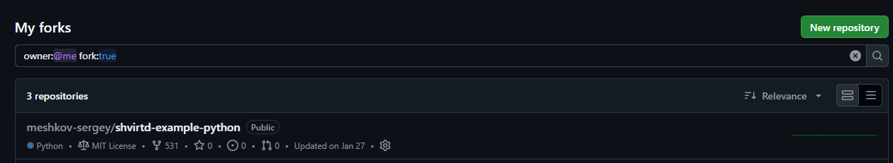

### Созданные файлы

#### `.dockerignore`

Исключаем из контекста сборки всё, что не нужно внутри контейнера: служебные файлы Git, кэш Python, виртуальные окружения, документацию, конфиги других сервисов.

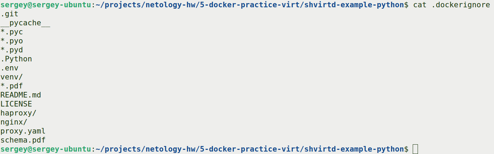

#### `Dockerfile.python`

Multistage-сборка: на первом этапе (`builder`) создаётся venv и ставятся зависимости, на втором — venv переносится в чистый `python:3.12-slim`.

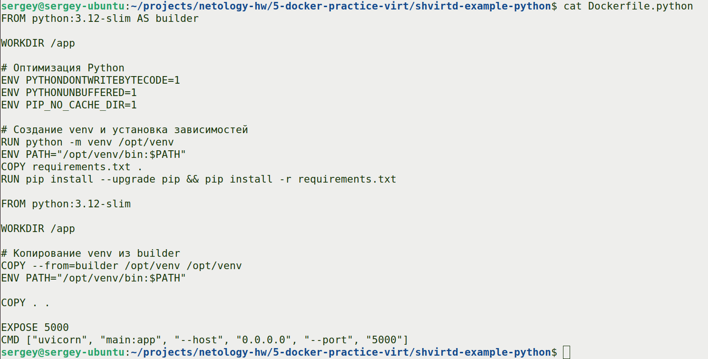

**Ключевые моменты:**
- Базовый образ: `python:3.12-slim`
- Multistage: `AS builder` + финальный этап
- `COPY . .` — копирование исходников
- Оптимизация Python через ENV: `PYTHONDONTWRITEBYTECODE`, `PYTHONUNBUFFERED`, `PIP_NO_CACHE_DIR`
- `CMD ["uvicorn", "main:app", "--host", "0.0.0.0", "--port", "5000"]`

### Сборка образа

```bash
docker build -f Dockerfile.python -t shvirtd-example-python:multistage .
```

Пояснение команд:
- `docker build` — команда сборки образа
- `-f Dockerfile.python` — указываем, какой файл использовать как Dockerfile (по умолчанию ищется `Dockerfile`)
- `-t shvirtd-example-python:multistage` — тег (имя:версия) для образа
- `.` — контекст сборки (текущая директория), откуда копируются файлы

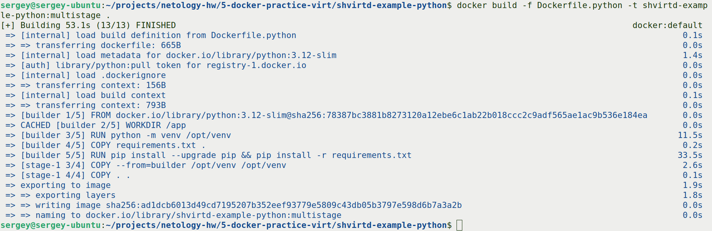

### Размер образа

```bash
docker images shvirtd-example-python
```

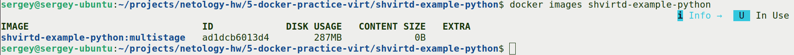

### Тестирование

Создана docker-сеть `hw-network`. В ней подняты:
- `mysql-hw` — MySQL 8 с базой `virtd`, пользователем `app`
- `app-hw` — наше приложение (порт 8090 хоста → 5000 контейнера)

Проверка работы через curl:

```bash
curl http://localhost:8090
```

Пояснение команд:
- `curl` — консольный HTTP-клиент
- `http://localhost:8090` — адрес и порт, на который шлём GET-запрос

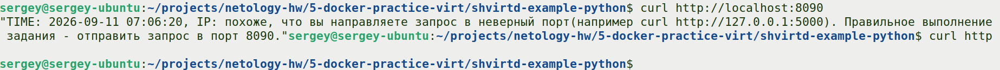

Проверка, что данные дошли до БД:

```bash
docker exec -it mysql-hw mysql -uapp -p<пароль_пользователя_app> virtd -e "SELECT * FROM requests;"
```

Пояснение команд:
- `docker exec` — выполнить команду внутри работающего контейнера
- `-it` — интерактивный режим с TTY
- `mysql-hw` — имя контейнера
- `mysql -uapp -p<пароль> virtd` — подключаемся к mysql под юзером `app` к базе `virtd`
- `-e "SQL"` — выполнить SQL-запрос и выйти

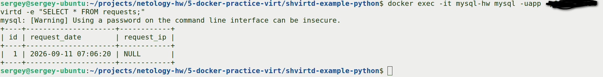

### Вывод

Multistage-сборка успешно реализована. Итоговый образ не содержит сборочных артефактов и кэша pip. Приложение запускается, подключается к MySQL по имени контейнера внутри docker-сети и корректно пишет данные в БД.

---

## Задача 3. Docker Compose + прокси (nginx + haproxy + web + db)

### Изучение `proxy.yaml`

В файле `proxy.yaml` уже описаны два сервиса и сеть `backend`:
- `reverse-proxy` — HAProxy 2.4, публикует `127.0.0.1:8080`, проксирует на `web:172.20.0.5:5000`
- `ingress-proxy` — Nginx, работает в `network_mode: host`, слушает 8090, проксирует на `127.0.0.1:8080`
- сеть `backend` типа bridge с подсетью `172.20.0.0/24`

### Создание `compose.yaml`

Создан файл `compose.yaml`, подключающий `proxy.yaml` через директиву `include`, и описывающий сервисы `web` и `db`.

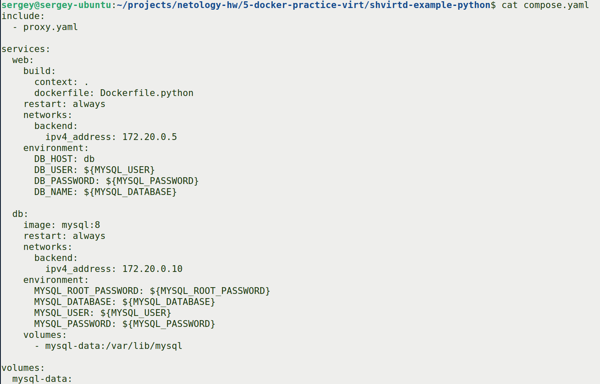

Пояснение ключевых директив:
- `include:` — подключает другой compose-файл, все сервисы/сети оттуда становятся частью общего проекта
- `build:` — собирает образ из `Dockerfile.python` при `docker compose up`
- `restart: always` — сервис всегда перезапускается при ошибках и после перезагрузки хоста
- `networks: backend: ipv4_address: ...` — фиксированный IP в сети `backend` (из `proxy.yaml`)
- `environment: DB_HOST: db` — приложение обращается к MySQL по имени сервиса `db` (внутри compose DNS резолвит имена сервисов)
- `${MYSQL_USER}` — значения подставляются из файла `.env` в корне проекта (docker compose читает его автоматически)
- `volumes: mysql-data:` — именованный volume для данных MySQL

### Запуск проекта

```bash
docker compose up -d
```

Пояснение команд:
- `docker compose` — работа с многоконтейнерными приложениями
- `up` — создать и запустить все сервисы из `compose.yaml` (включая подключённые через `include`)
- `-d` (detached) — в фоне

Проверка статуса:

```bash
docker compose ps
```

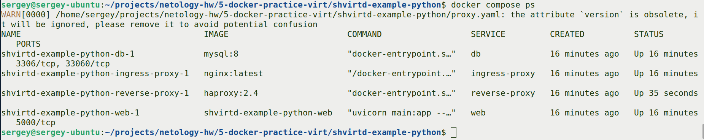

### Проверка работы

```bash
curl -L http://127.0.0.1:8090
```

Пояснение команд:
- `-L` — следовать за редиректами (если они будут)
- `http://127.0.0.1:8090` — порт nginx-ingress, который в host-режиме, поэтому доступен на localhost

Результат — JSON с временем и локальным IP-адресом, что подтверждает корректную работу полного стека: nginx → haproxy → web → db.

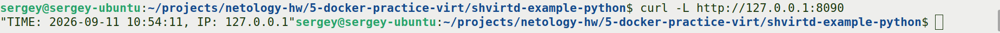

### Подключение к БД и SQL-запросы

```bash
docker exec -ti shvirtd-example-python-db-1 mysql -uroot -p<пароль_root>
```

Пояснение команд:
- `docker exec -ti` — интерактивно (i) с терминалом (t) выполнить команду в контейнере
- `shvirtd-example-python-db-1` — имя контейнера с MySQL
- `mysql -uroot -p<пароль>` — подключение под root. Важно: между `-u` и `root`, а также между `-p` и паролем **нет пробела**

Далее последовательно выполнены SQL-запросы:

```sql
show databases;
use virtd;
show tables;
SELECT * from requests LIMIT 10;
```

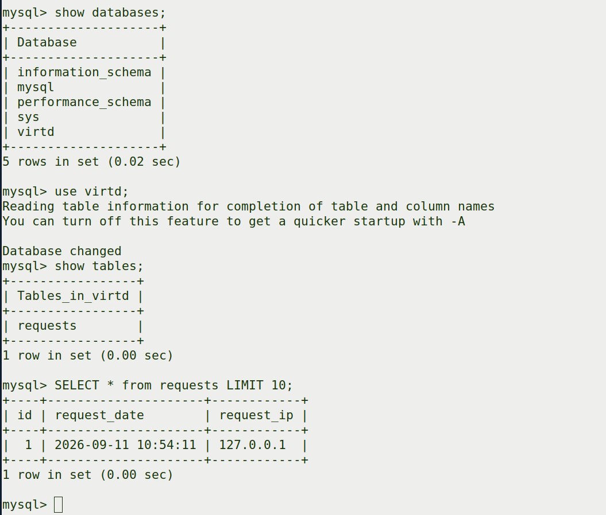

### Остановка проекта

```bash
docker compose down
```

Пояснение команд:
- `down` — останавливает и удаляет все контейнеры и сети, созданные `compose up` (именованные volumes по умолчанию сохраняются)

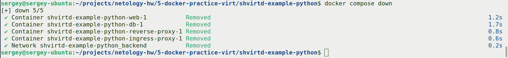

### Вывод

С помощью `docker compose` и директивы `include` удалось собрать полный стек: nginx-ingress (host) → haproxy (backend 172.20.0.2) → web (backend 172.20.0.5) → db (backend 172.20.0.10). Все сервисы общаются по именам внутри bridge-сети `backend`. Секреты (пароли) вынесены в `.env` и подставляются через переменные. Проект успешно запускается, отвечает на `curl -L http://127.0.0.1:8090` временем и IP, а данные корректно пишутся в MySQL.

---

## Автор

- **Студент**: Мешков Сергей
- **Курс**: Netology, DevOps
- **Дата выполнения**: Сентябрь 2026
