# Домашнее задание к занятию 5. «Практическое применение Docker»

---

## Задача 1. Dockerfile.python с multistage сборкой

### Форк репозитория

Сделан форк репозитория `shvirtd-example-python` в личное GitHub-пространство.


### Созданные файлы

#### `.dockerignore`

Исключаем из контекста сборки всё, что не нужно внутри контейнера: служебные файлы Git, кэш Python, виртуальные окружения, документацию, конфиги других сервисов.


#### `Dockerfile.python`

Multistage-сборка: на первом этапе (`builder`) создаётся venv и ставятся зависимости, на втором — venv переносится в чистый `python:3.12-slim`.


**Ключевые моменты:**
- Базовый образ: `python:3.12-slim`
- Multistage: `AS builder` + финальный этап
- `COPY . .` — копирование исходников
- Оптимизация Python через ENV: `PYTHONDONTWRITEBYTECODE`, `PYTHONUNBUFFERED`, `PIP_NO_CACHE_DIR`
- `CMD ["uvicorn", "main:app", "--host", "0.0.0.0", "--port", "5000"]`

### Сборка образа

```bash
docker build -f Dockerfile.python -t shvirtd-example-python:multistage .
```

Пояснение команд:
- `docker build` — команда сборки образа
- `-f Dockerfile.python` — указываем, какой файл использовать как Dockerfile (по умолчанию ищется `Dockerfile`)
- `-t shvirtd-example-python:multistage` — тег (имя:версия) для образа
- `.` — контекст сборки (текущая директория), откуда копируются файлы


### Размер образа

```bash
docker images shvirtd-example-python
```


### Тестирование

Создана docker-сеть `hw-network`. В ней подняты:
- `mysql-hw` — MySQL 8 с базой `virtd`, пользователем `app`
- `app-hw` — наше приложение (порт 8090 хоста → 5000 контейнера)

Проверка работы через curl:

```bash
curl http://localhost:8090
```

Пояснение команд:
- `curl` — консольный HTTP-клиент
- `http://localhost:8090` — адрес и порт, на который шлём GET-запрос


Проверка, что данные дошли до БД:

```bash
docker exec -it mysql-hw mysql -uapp -p<пароль_пользователя_app> virtd -e "SELECT * FROM requests;"
```

Пояснение команд:
- `docker exec` — выполнить команду внутри работающего контейнера
- `-it` — интерактивный режим с TTY
- `mysql-hw` — имя контейнера
- `mysql -uapp -p<пароль> virtd` — подключаемся к mysql под юзером `app` к базе `virtd`
- `-e "SQL"` — выполнить SQL-запрос и выйти


### Вывод

Multistage-сборка успешно реализована. Итоговый образ не содержит сборочных артефактов и кэша pip. Приложение запускается, подключается к MySQL по имени контейнера внутри docker-сети и корректно пишет данные в БД.

---

## Задача 3. Docker Compose + прокси (nginx + haproxy + web + db)

### Изучение `proxy.yaml`

В файле `proxy.yaml` уже описаны два сервиса и сеть `backend`:
- `reverse-proxy` — HAProxy 2.4, публикует `127.0.0.1:8080`, проксирует на `web:172.20.0.5:5000`
- `ingress-proxy` — Nginx, работает в `network_mode: host`, слушает 8090, проксирует на `127.0.0.1:8080`
- сеть `backend` типа bridge с подсетью `172.20.0.0/24`

### Создание `compose.yaml`

Создан файл `compose.yaml`, подключающий `proxy.yaml` через директиву `include`, и описывающий сервисы `web` и `db`.


Пояснение ключевых директив:
- `include:` — подключает другой compose-файл, все сервисы/сети оттуда становятся частью общего проекта
- `build:` — собирает образ из `Dockerfile.python` при `docker compose up`
- `restart: always` — сервис всегда перезапускается при ошибках и после перезагрузки хоста
- `networks: backend: ipv4_address: ...` — фиксированный IP в сети `backend` (из `proxy.yaml`)
- `environment: DB_HOST: db` — приложение обращается к MySQL по имени сервиса `db` (внутри compose DNS резолвит имена сервисов)
- `${MYSQL_USER}` — значения подставляются из файла `.env` в корне проекта (docker compose читает его автоматически)
- `volumes: mysql-data:` — именованный volume для данных MySQL

### Запуск проекта

```bash
docker compose up -d
```

Пояснение команд:
- `docker compose` — работа с многоконтейнерными приложениями
- `up` — создать и запустить все сервисы из `compose.yaml` (включая подключённые через `include`)
- `-d` (detached) — в фоне

Проверка статуса:

```bash
docker compose ps
```


### Проверка работы

```bash
curl -L http://127.0.0.1:8090
```

Пояснение команд:
- `-L` — следовать за редиректами (если они будут)
- `http://127.0.0.1:8090` — порт nginx-ingress, который в host-режиме, поэтому доступен на localhost

Результат — JSON с временем и локальным IP-адресом, что подтверждает корректную работу полного стека: nginx → haproxy → web → db.


### Подключение к БД и SQL-запросы

```bash
docker exec -ti shvirtd-example-python-db-1 mysql -uroot -p<пароль_root>
```

Пояснение команд:
- `docker exec -ti` — интерактивно (i) с терминалом (t) выполнить команду в контейнере
- `shvirtd-example-python-db-1` — имя контейнера с MySQL
- `mysql -uroot -p<пароль>` — подключение под root. Важно: между `-u` и `root`, а также между `-p` и паролем **нет пробела**

Далее последовательно выполнены SQL-запросы:

```sql
show databases;
use virtd;
show tables;
SELECT * from requests LIMIT 10;
```


### Остановка проекта

```bash
docker compose down
```

Пояснение команд:
- `down` — останавливает и удаляет все контейнеры и сети, созданные `compose up` (именованные volumes по умолчанию сохраняются)


### Вывод

С помощью `docker compose` и директивы `include` удалось собрать полный стек: nginx-ingress (host) → haproxy (backend 172.20.0.2) → web (backend 172.20.0.5) → db (backend 172.20.0.10). Все сервисы общаются по именам внутри bridge-сети `backend`. Секреты (пароли) вынесены в `.env` и подставляются через переменные. Проект успешно запускается, отвечает на `curl -L http://127.0.0.1:8090` временем и IP, а данные корректно пишутся в MySQL.

---

---

## Задача 4. Деплой в Yandex Cloud

### Создание ВМ

В Yandex Cloud создана ВМ:
- Образ: Ubuntu 24.04 LTS
- 2 vCPU, 2 ГБ RAM, 10 ГБ HDD
- Публичный IP: `51.250.92.180` (зарезервирован статически)
- В группу безопасности `default-sg-...` добавлено правило: входящий TCP 8090 из `0.0.0.0/0`

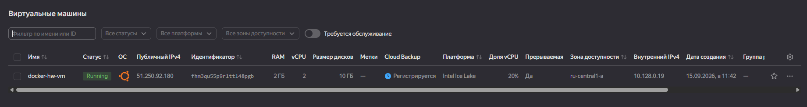

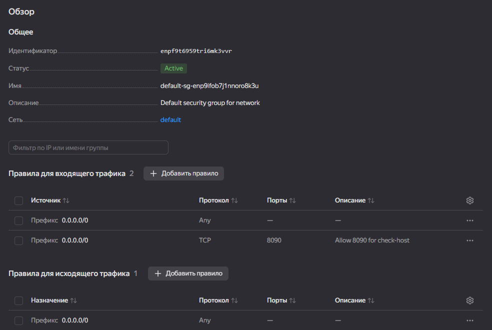

### Установка Docker

Подключение по SSH и установка Docker через официальный скрипт:

```bash
ssh -i ~/.ssh/yc_key smeshkov@51.250.92.180

curl -fsSL https://get.docker.com -o get-docker.sh
sudo sh get-docker.sh

docker --version
docker compose version
```

Пояснение команд:
- `ssh -i ~/.ssh/yc_key smeshkov@51.250.92.180` — подключение к ВМ с указанием приватного ключа
- `curl -fsSL` — флаги: `-f` без HTML-ошибок, `-s` тихий, `-S` показать ошибки, `-L` следовать редиректам
- `-o get-docker.sh` — сохранить в файл
- `sudo sh get-docker.sh` — запустить установочный скрипт
- `docker --version` / `docker compose version` — проверка установки

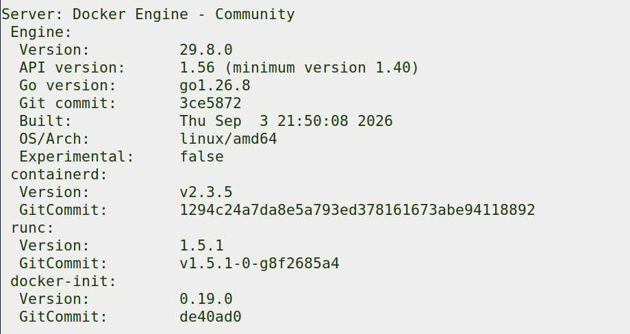

### Bash-скрипт деплоя

Создан `/home/smeshkov/deploy.sh`, который клонирует fork в `/opt/shvirtd-example-python` и запускает проект через `docker compose`.

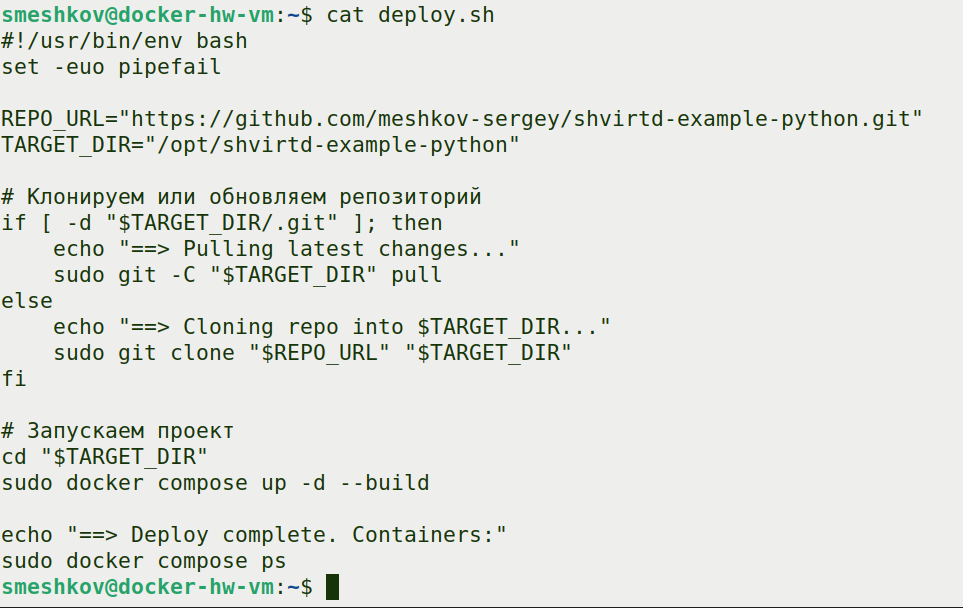

Пояснение ключевых строк:
- `set -euo pipefail` — строгий режим bash
- `REPO_URL` — ссылка на fork репозитория
- `TARGET_DIR="/opt/shvirtd-example-python"` — каталог для клонирования (по заданию)
- `git -C "$TARGET_DIR" pull` — обновление репо, если уже склонирован
- `git clone "$REPO_URL" "$TARGET_DIR"` — клонирование
- `docker compose up -d --build` — сборка и запуск в фоне

### Запуск проекта на ВМ

```bash
./deploy.sh
```

Результат — 4 контейнера запущены:

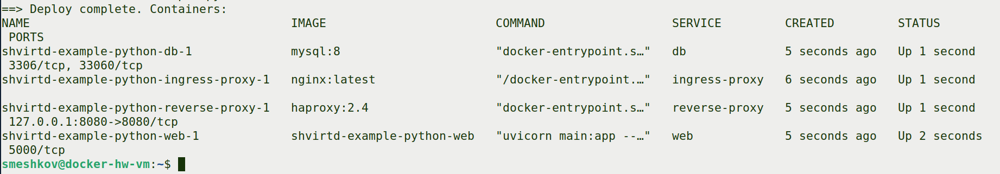

### Проверка работы

Локально на ВМ:

```bash
curl -L http://127.0.0.1:8090
```

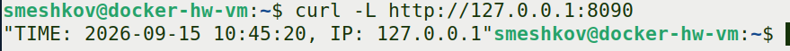

### Проверка через check-host

Запущена проверка `http://51.250.92.180:8090` на https://check-host.net/check-http

Все локации вернули **200 OK** — сервис доступен из интернета.

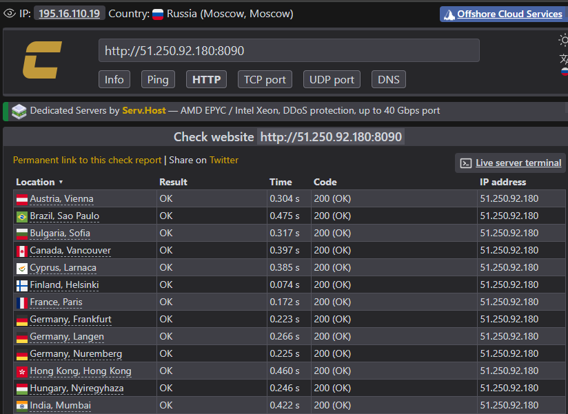

Проверка из браузера — в ответе JSON с временем и **реальным публичным IP** (не 127.0.0.1):

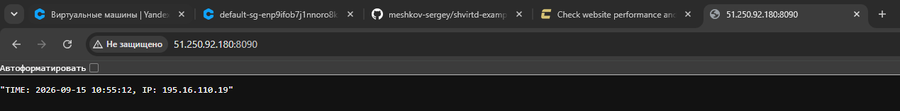

Проверка через curl с внешней машины:

```bash
curl -L http://51.250.92.180:8090
```

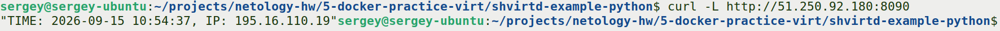

**Что доказывает цепочку:** в ответе виден реальный публичный IP клиента (`195.16.110.19`). Трафик прошёл: Internet → Nginx (8090) → HAProxy (8080) → FastAPI (5000) → MySQL → HAProxy → Nginx → Internet → клиент.

### SQL-запрос на сервере

```bash
sudo docker exec -ti shvirtd-example-python-db-1 mysql -uroot -p<пароль_root>
```

Далее:

```sql
show databases;
use virtd;
show tables;
SELECT * from requests LIMIT 10;
```

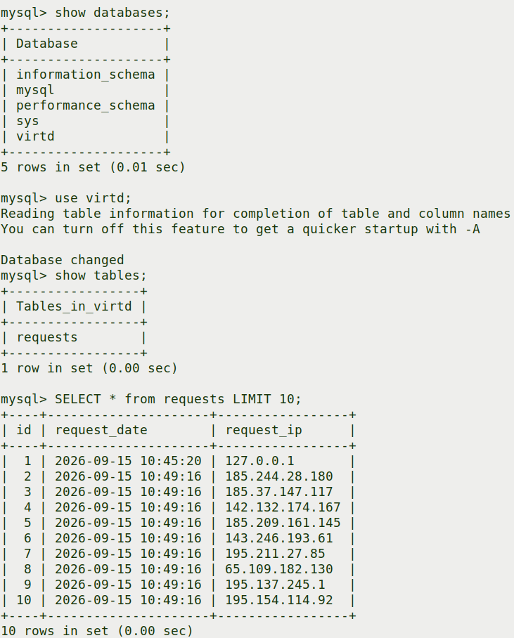

В таблице `requests` записи от:
- `127.0.0.1` — локальный curl с ВМ
- `185.244.28.180`, `185.37.147.117`, `142.132.174.167` и др. — IP серверов check-host

Это доказывает, что внешний трафик реально дошёл до FastAPI и записался в MySQL.

### Остановка проекта

```bash
cd /opt/shvirtd-example-python
sudo docker compose down
```

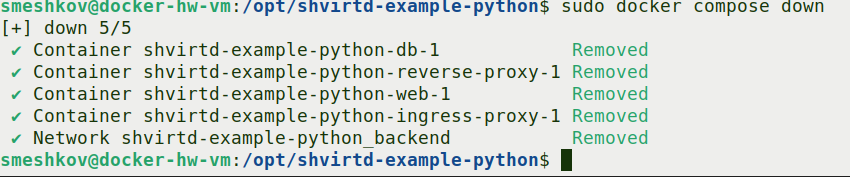

### Ссылка на fork

https://github.com/meshkov-sergey/shvirtd-example-python


---

## Задача 6. Извлечение бинарника из Docker-образа

### Исследование образа через dive

Исследование образа в утилите `dive`:

```bash
dive hashicorp/terraform:latest
```

**Что видно в dive:**
- Список слоёв образа слева — от базового (`FROM blobs`) до слоя с terraform
- Отдельный слой с командой `COPY dist/linux/amd64/terraform /bin/terraform` размером **120 MB** — именно в нём лежит наш бинарник
- Содержимое выбранного слоя справа — видна директория `/bin` со симлинками busybox и сам файл `terraform`
- Общая эффективность образа 99% — лишних слоёв почти нет

**Зачем это нужно:** `dive` позволяет точно определить, в каком слое лежит нужный файл. Это важно для `docker save`, потому что образ сохраняется как набор отдельных tar-слоёв, и при извлечении файла надо распаковать **правильный** слой. Зная размер (~120 MB) и то что он последний, мы легко найдём его среди `blobs/sha256/*` — это будет самый большой файл.

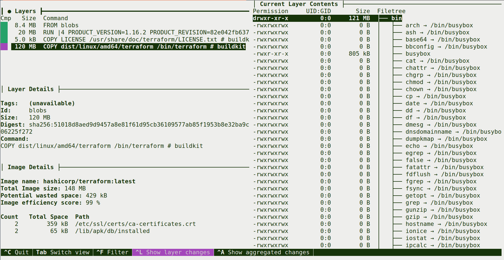

### Эталонный хеш из контейнера

```bash
docker run --rm --entrypoint sh hashicorp/terraform:latest -c "sha256sum /bin/terraform && /bin/terraform --version"
```

Пояснение команд:
- `sha256sum /bin/terraform` — эталонный хеш для сверки
- `&& /bin/terraform --version` — проверка версии

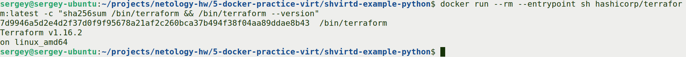

### Извлечение через docker save

```bash
mkdir -p ~/terraform-extract
cd ~/terraform-extract
docker save -o terraform.tar hashicorp/terraform:latest
ls -lh terraform.tar
```

Пояснение команд:
- `mkdir -p` — создать директорию с родительскими при необходимости
- `docker save -o terraform.tar` — сохранить образ в tar-архив
- `-o` — файл для сохранения

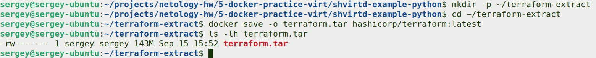

### Распаковка архива и поиск слоя

```bash
tar -xf terraform.tar
ls -la
du -sh blobs/sha256/* | sort -h | tail -3
```

Пояснение команд:
- `tar -xf` — распаковать tar-архив (`-x` extract, `-f` file)
- `du -sh` — размер файлов (`-s` summary, `-h` human-readable)
- `sort -h | tail -3` — сортировка по размеру, вывод 3 самых больших

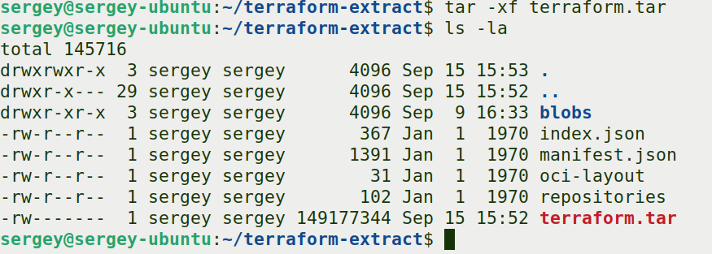

Самый большой слой (115 MB) — это слой с `/bin/terraform`. Извлекаем его:

```bash
mkdir extracted
tar -xf blobs/sha256/<hash_слоя> -C extracted
ls -la extracted/bin/
```

Пояснение команд:
- `-C extracted` — распаковать в указанную директорию

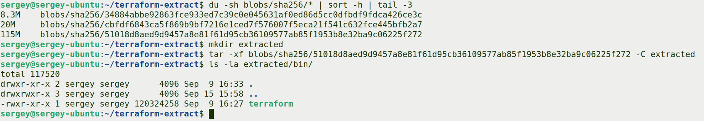

### Проверка валидности

Копируем бинарник в домашний каталог, даём право на выполнение, проверяем хеш и версию:

```bash
cp extracted/bin/terraform ~/terraform
chmod +x ~/terraform
sha256sum ~/terraform
~/terraform --version
```

Пояснение команд:
- `cp` — копирование файла
- `chmod +x` — добавить право на выполнение
- `sha256sum` — проверка хеша
- `--version` — проверка работоспособности

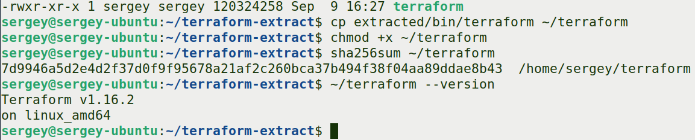

Хеш совпал с эталонным (`7d9946a5...`), версия `v1.16.2` — бинарник извлечён корректно.

## Автор

- **Студент**: Мешков Сергей
- **Курс**: Netology, DevOps
- **Дата выполнения**: Сентябрь 2026
